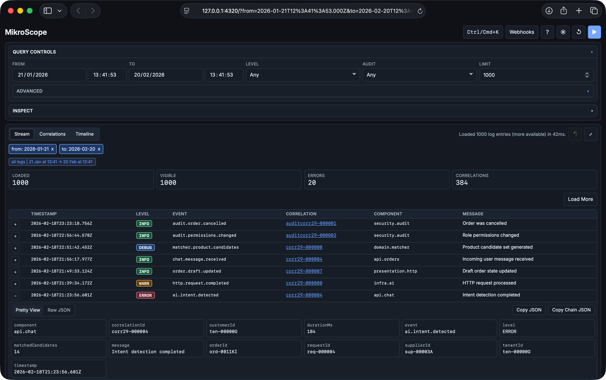

# MikroScope Console

**A sharp, self-hosted console for [MikroScope](https://github.com/mikaelvesavuori/mikroscope) that turns logs into instant queries, timelines, and actionable alerts.**

MikroScope Console is a static web UI for investigating logs, correlations, and time patterns without running a heavy observability stack.



## What You Get

- **Stream view**: Browse logs with expandable rows and load-more pagination.
- **Inspect tools**: Jump directly to `correlationId` or `requestId`, then refine with local filtering/sorting.
- **Correlation cards**: Group by correlation IDs, inspect error density, and copy IDs or chain JSON.
- **Timeline drilldown**: See temporal distribution and scope quickly by bucket.
- **Alert webhook status**: Inspect runtime alert state and active policy from `/health`.
- **Alert webhook config modal**: Reload, save, test, and clear alert webhook settings from the UI.
- **Saved queries + shareable view URLs**: Reuse and share exact investigation scopes.
- **Keyboard-first workflows**: Command palette and hotkeys for rapid navigation and execution.

## Requirements

- MikroScope API (default target: `http://127.0.0.1:4310`).
  - Core use requires `/api/logs`.
  - Insights and alert features require additional endpoints listed below.
- Modern browser (Chromium, Firefox, Safari).
- Static hosting option (any web server or CDN) since the console is static frontend code.

## Install

Install methods:

- One-line installer (recommended):

```bash
curl -fsSL https://raw.githubusercontent.com/mikaelvesavuori/mikroscope-console/main/install.sh -o install.sh && sh install.sh && rm install.sh
```

- One-line installer with pinned version and custom path:

```bash
curl -fsSL https://raw.githubusercontent.com/mikaelvesavuori/mikroscope-console/main/install.sh -o install.sh && sh install.sh --version vX.Y.Z --dir /srv/mikroscope-console && rm install.sh
```

- Manual release install:
  - Download archive from [GitHub Releases](https://github.com/mikaelvesavuori/mikroscope-console/releases).
  - Extract and host the `public/` directory.

- Local development from source:

```bash
npm install
npm start
```

## Quick Start

1. Install the console using one of the install methods above.
1. Set your MikroScope API origin in `public/config.json` (or `src/config.json` in local development):

```json
{
  "apiOrigin": "http://127.0.0.1:4310"
}
```

1. Serve static files:

```bash
npx http-server public -p 4320 -c-1
```

1. Open `http://127.0.0.1:4320/`.

## Configuration

Config file locations:

- `public/config.json`: use when running from a prebuilt release bundle.
- `src/config.json`: use when running from this repository in local development.

Supported keys:

- `apiOrigin` (string, required): base URL of your MikroScope API.
  - Default: `http://127.0.0.1:4310`.
  - Example: `https://logs.example.com`.

## Feature Availability

- **Stream + Inspect + Correlations + Timeline**
  - Requires: `GET /api/logs`.
  - If missing: core querying cannot run.
- **Insights cards**
  - Requires: `GET /api/logs/aggregate`.
  - If missing: insights cards show limited/empty data.
- **Alert webhook status**
  - Requires: `GET /health`.
  - If missing: alert policy/runtime status cannot refresh in the UI.
- **Alert webhook config modal**
  - Requires: `GET /openapi.json`, `GET /api/alerts/config`, `PUT /api/alerts/config`.
  - If missing: modal can open, but management actions remain unavailable.
- **Alert webhook test action**
  - Requires: `POST /api/alerts/test-webhook`.
  - If missing: save/update can still work, but test action is disabled.

## Daily Usage

- Fetch logs in a time window:
  - Go to Query Controls.
  - Set `From`, `To`, and optional filters.
  - Run query (`Enter` or play button).
- Investigate a single trace:
  - Use Inspect.
  - Set key (`Auto`, `correlationId`, or `requestId`) and value.
  - Click `Go to Trace`.
- Narrow by traffic spikes:
  - Open Timeline.
  - Click a bucket to drill down; click again to clear.
- Reuse common filters:
  - Open Query Controls > Advanced.
  - Save, select, and run saved queries.
- Share an exact scope:
  - Click `Copy View URL` or press `U`.
- Work in expanded stream:
  - Press `Space` or click the expand icon.
- Manage alerting:
  - View status in Insights (`Alert Webhook` card).
  - Manage policy in Top bar > `Webhooks`.

## Keyboard Shortcuts

- `Ctrl/Cmd + K`: Open command palette.
- `Q`: Toggle query controls.
- `I`: Toggle inspect panel.
- `N`: Toggle insights panel.
- `W`: Toggle webhook config modal.
- `S`: Open stream tab.
- `C`: Open correlations tab.
- `T`: Open timeline tab.
- `U`: Copy current view URL path.
- `X`: Reset to baseline query.
- `Enter`: Run query.
- `Space`: Toggle expanded stream.
- `?`: Toggle shortcuts help.

Shortcuts are ignored while typing in inputs, textareas, selects, buttons, and editable fields.

## Shareable View URL Parameters

Copied view URLs preserve query state with these parameters:

- `from`: start timestamp (ISO-8601), for example `2026-02-18T00:00:00.000Z`.
- `to`: end timestamp (ISO-8601), for example `2026-02-18T23:59:59.999Z`.
- `level`: log level filter (for example `ERROR`).
- `audit`: audit filter (`true` or `false`).
- `field`: field key used with `value` (for example `correlationId`).
- `value`: server-side field value filter.
- `limit`: server-side max rows (`1-1000`).

## MikroScope API Compatibility

Console behavior depends on the following endpoints:

- `GET /api/logs`
  - Used for: main stream query and pagination.
  - Expected fields: `entries` (array), `hasMore` (boolean), `nextCursor` (string/null).
- `GET /api/logs/aggregate`
  - Used for: insights cards (`level`, `event`, `component`, `correlation`).
  - Expected fields: `buckets` (array of `{ key, count }`).
- `GET /health`
  - Used for: alert runtime and policy status.
  - Expected fields: `alerting`, `alertPolicy`.
- `GET /api/alerts/config`
  - Used for: load active alert webhook policy.
  - Expected fields: `policy`.
- `PUT /api/alerts/config`
  - Used for: save alert webhook policy updates.
  - Expected fields: `policy`.
- `POST /api/alerts/test-webhook`
  - Used for: send a manual webhook test event.
  - Expected fields: `ok`, `sentAt`, `targetUrl`.
- `GET /openapi.json`
  - Used for: alert config endpoint discovery.
  - Expected fields: `paths` containing alert operations.

## Deploying

Because the console is static, you can host it anywhere:

- Nginx, Caddy, or Apache serving `public/` (release) or `dist/` (source build).
- Object storage + CDN for global delivery and aggressive caching.
- Local troubleshooting with:

```bash
npx http-server public -p 4320 -c-1
```

Minimal Caddy example:

```caddyfile
console.example.com {
  root * /srv/mikroscope-console/public
  file_server
}
```

## Troubleshooting

- **No logs appear**: `apiOrigin` is wrong or the API is unavailable. Verify `config.json` and test reachability.
- **Logs load but insights are empty**: aggregate endpoint may be missing. Check `GET /api/logs/aggregate`.
- **Timeline looks empty or inconsistent**: timestamps may be missing/invalid. Ensure entries contain parseable timestamps.
- **Browser shows CORS/network errors**: API does not allow your console origin. Configure backend CORS accordingly.

## Maintainers

Developer and release workflows are documented in `docs/MAINTAINERS.md`.
